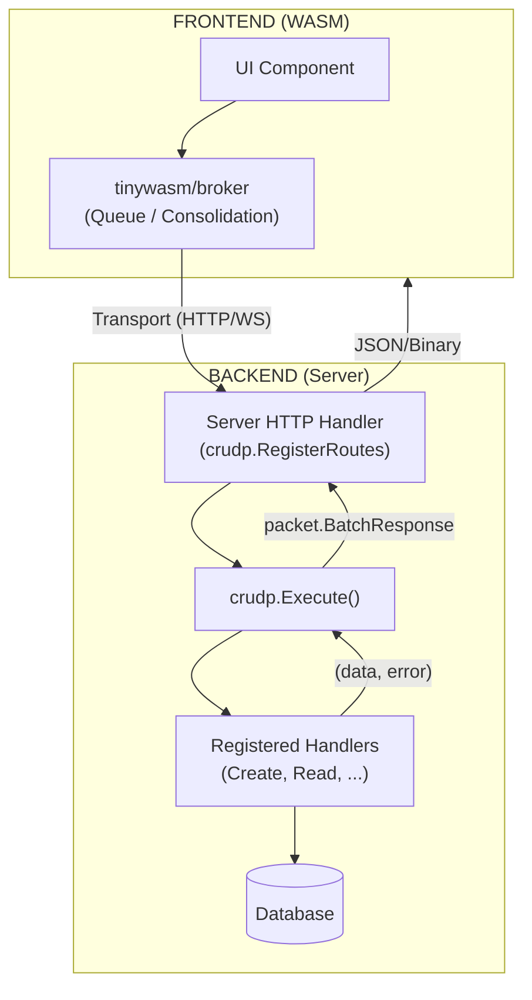

# CRUDP Architecture

> **Status:** Specification Document  
> **Last Updated:** January 2026

## Overview

CRUDP (CRUD Protocol) is a logic-only execution engine for isomorphic Go applications. It handles the registration and execution of CRUD operations, delegating transport/batching to tools like `tinywasm/broker`.

## Core Principles

1. **Isomorphic Handlers:** Same handler code runs on frontend (WASM) and backend (Server).
2. **Zero Transport Coupling:** CRUDP doesn't know about HTTP, WebSockets, or SSE.
3. **Explicit Error Handling:** CRUD methods return `(any, error)` for reliable flow control.
4. **Protocol Agnostic:** Works with any data structure defined in `tinywasm/packet`.
5. **TinyGo Compatible:** Optimized for small WASM binaries.

## Modular Architecture

1. **`tinywasm/broker`**: Handles client-side batching and consolidation of requests.
2. **`tinywasm/crudp`**: (This repo) Defines protocol types (Packet, BatchRequest, BatchResponse) and maps them to registered handlers.

### Workflow Diagram



## Key Decisions

| Decision | Choice | Rationale |
|----------|--------|-----------|
| Serialization | `Encode`/`Decode` funcs | Support JSON (tinywasm/json) or Binary (tinywasm/binary) formats |
| Handler signature | `func(ctx, data ...any) (any, error)` | Explicit errors allow better client-side feedback |
| Packet structure | Internal to `crudp` | Unified protocol definition and execution |
| Batching | Delegated to `tinywasm/broker` | Keep CRUDP core simple and focused on execution |
| Message types | `0-4` (uint8) | Normal, Info, Error, Warning, Success from `tinywasm/fmt` |
| HTTP methods | POST/GET/PUT/DELETE → c/r/u/d | Standard CRUD mapping |
| HandlerName | Automatic or Explicit | Use `NamedHandler` interface or reflection fallback |

## Dependencies

```
crudp
├── github.com/tinywasm/binary # Recommended codec
└── github.com/tinywasm/fmt    # String conversion and message types
```

## Key Interfaces

```go
// CRUD interfaces - return (any, error)
type Creator interface { Create(ctx context.Context, data ...any) (any, error) }
type Reader interface  { Read(ctx context.Context, data ...any) (any, error) }
type Updater interface { Update(ctx context.Context, data ...any) (any, error) }
type Deleter interface { Delete(ctx context.Context, data ...any) (any, error) }

// Optional interfaces
type NamedHandler interface { HandlerName() string }
type Validator interface { Validate(action byte, data ...any) error }
type FieldValidator interface { ValidateField(fieldName, value string) error }
```

## Implementation Status

| Feature | Status | Package |
|------|--------|----------|
| Batching | ✅ Done | `tinywasm/broker` |
| Execution | ✅ Done | `tinywasm/crudp` |
| Protocol Details | ✅ Done | `tinywasm/crudp` |
| HTTP Integration | ✅ Done | `tinywasm/crudp` (RegisterRoutes) |

## Related Documentation

- [INTEGRATION_GUIDE.md](INTEGRATION_GUIDE.md) - How to integrate CRUDP
- [INITIALIZATION.md](INITIALIZATION.md) - Initialization and serialization
- [HANDLER_REGISTER.md](HANDLER_REGISTER.md) - How to create and register handlers
- [LIMITATIONS.md](LIMITATIONS.md) - Supported data types
